!SLIDE
# demo

!SLIDE center
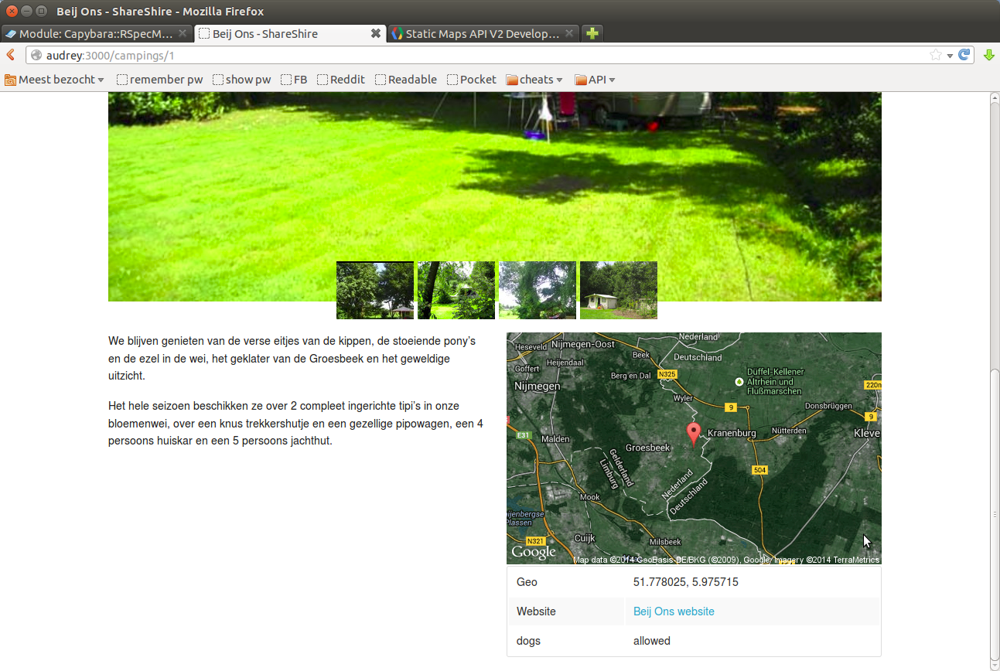

!SLIDE center
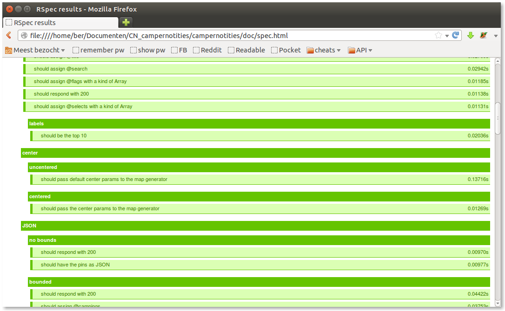

!SLIDE center
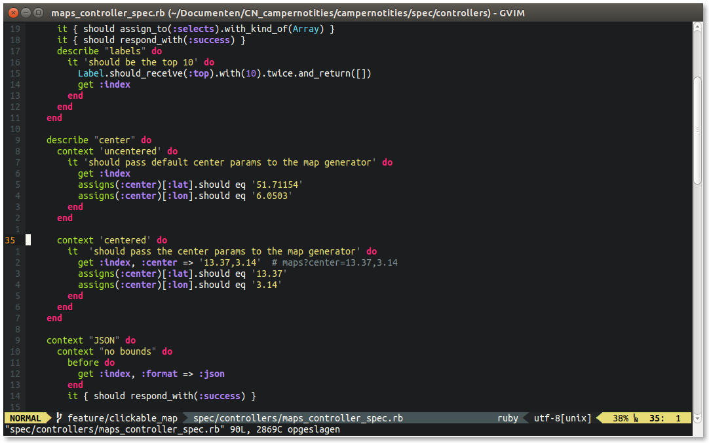

!SLIDE center
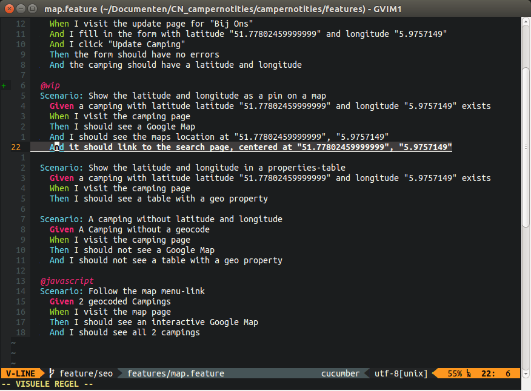

!SLIDE center
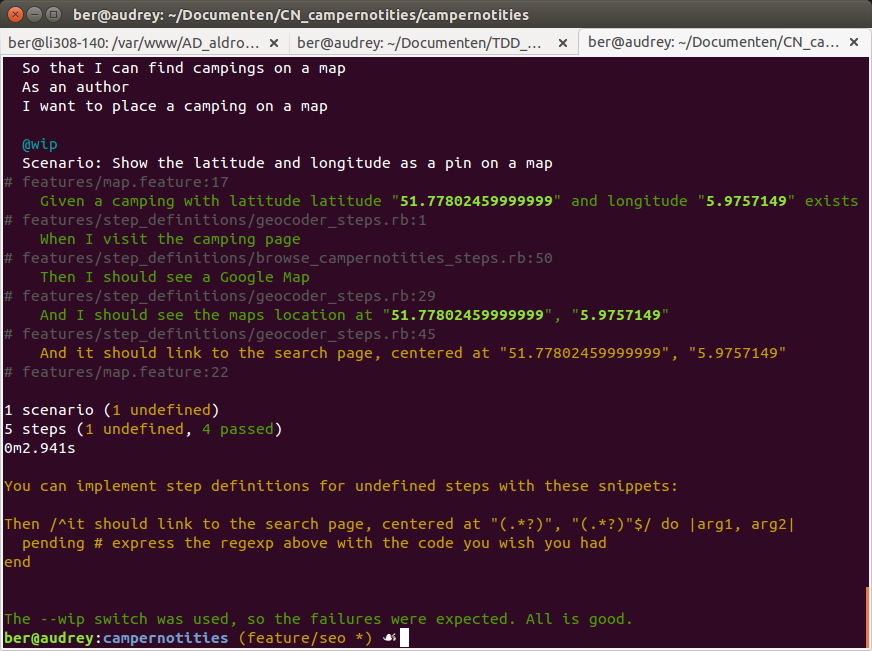

!SLIDE center
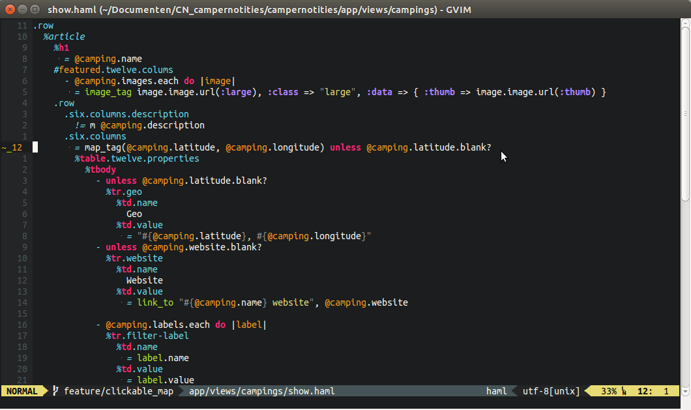

!SLIDE center
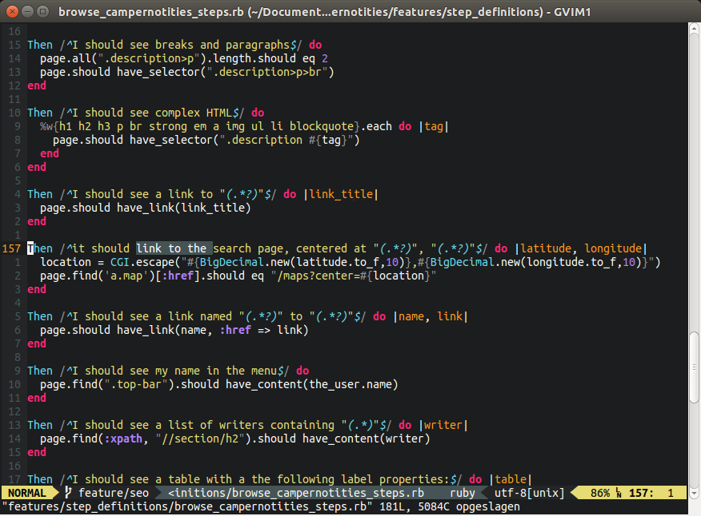

!SLIDE center
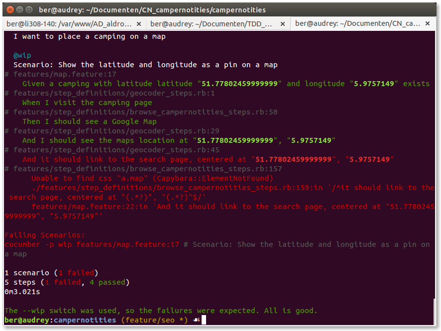

!SLIDE center

!SLIDE center
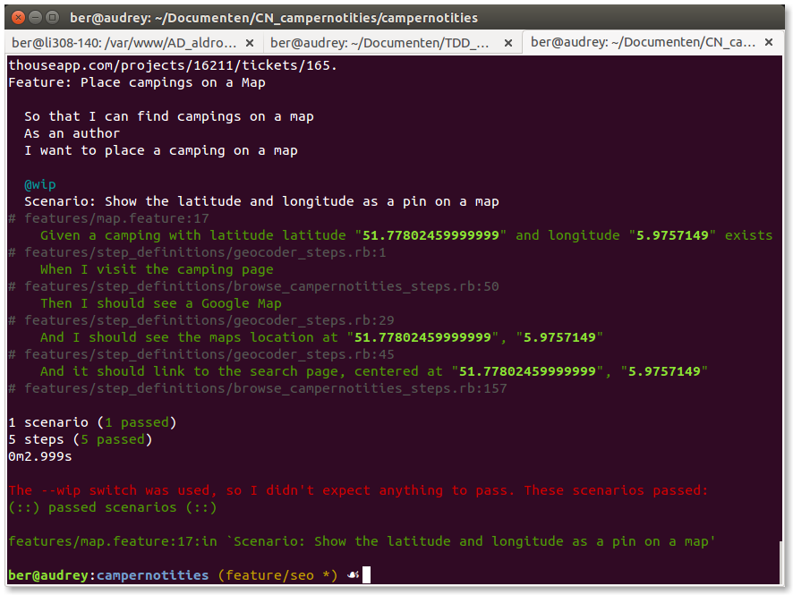

!SLIDE center
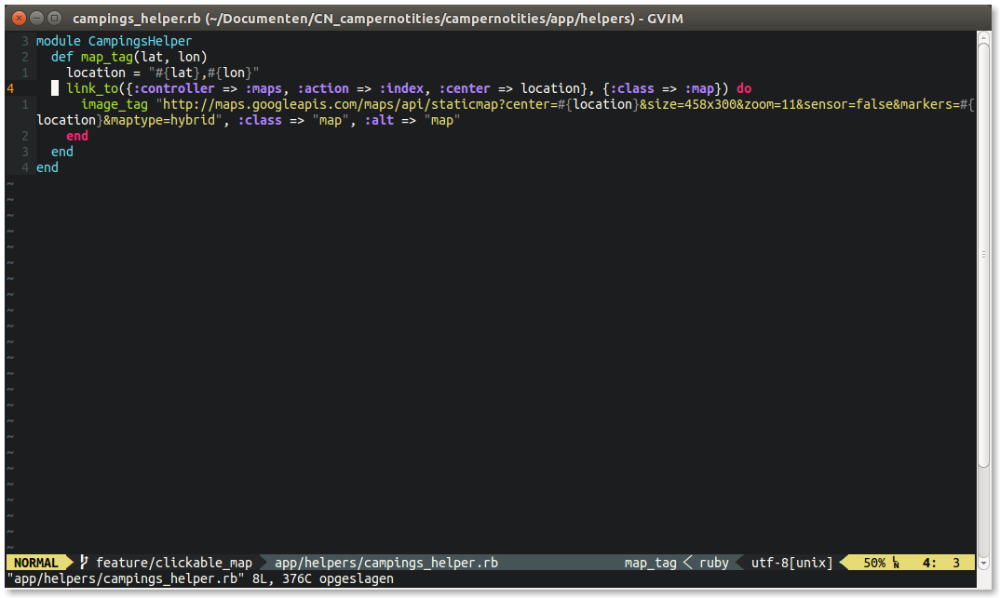

!SLIDE center

!SLIDE center
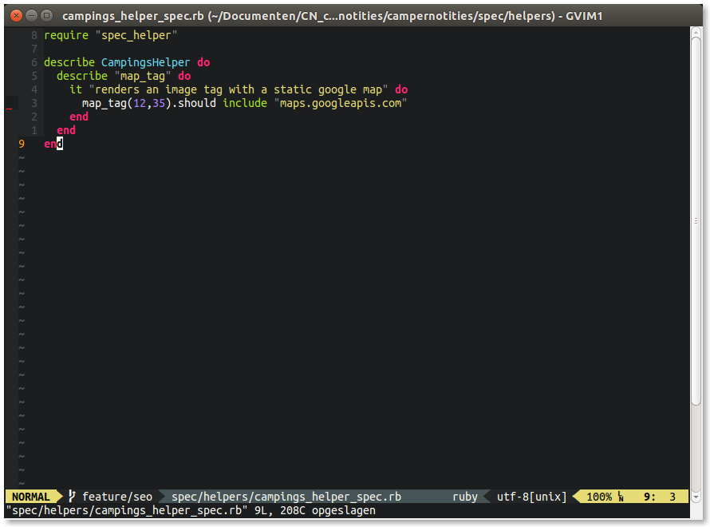

!SLIDE center
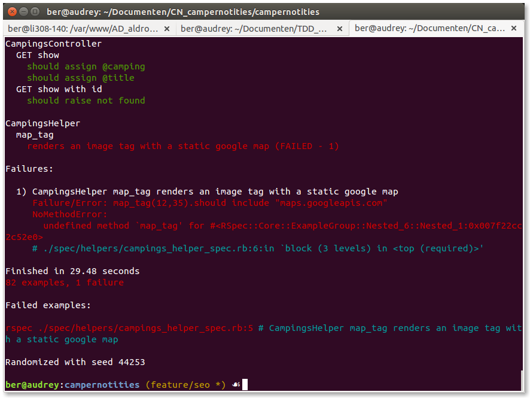

!SLIDE center

!SLIDE center
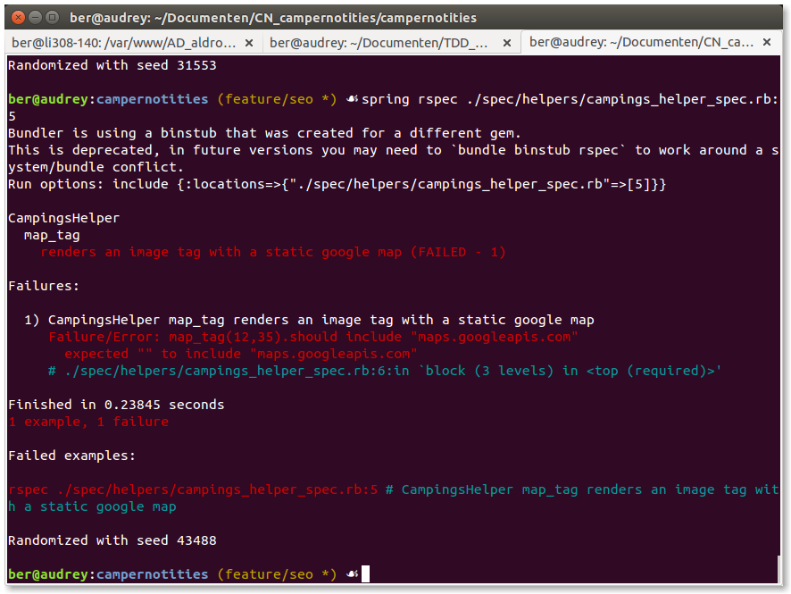

!SLIDE center
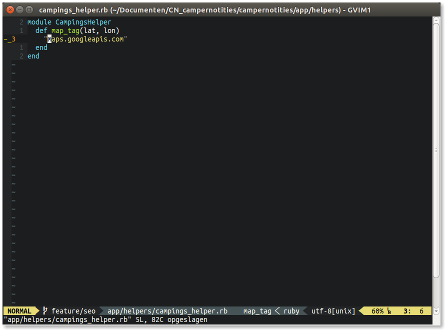

!SLIDE center
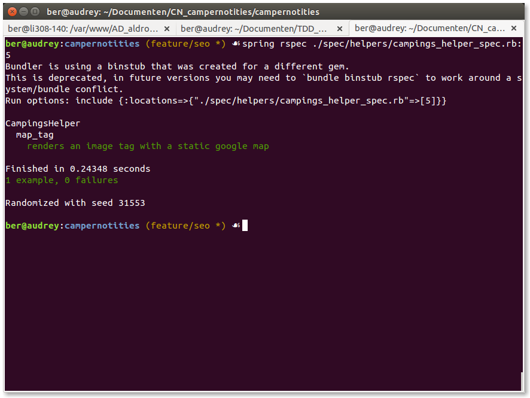

!SLIDE center
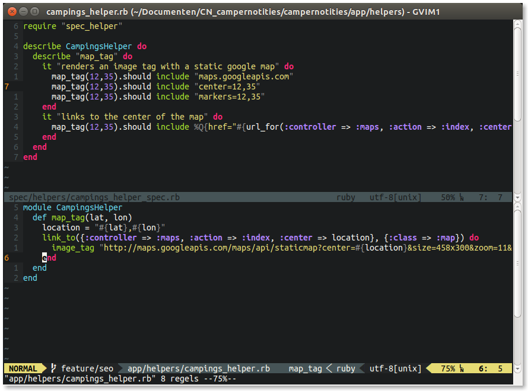

!SLIDE
# demo with Firefox

!SLIDE
# demo headless
