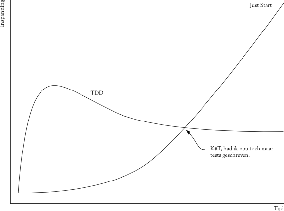

!SLIDE center

!SLIDE center
# Effort curve

!SLIDE bullets incremental
# LinkDump
* Behat [behat.org](http://behat.org) Feature Tests
* 

!SLIDE bullets incremental
# Opmerkingen
* Je hebt geen testframework nodig om te testen. Tests zijn ook gewoon
  code.
* Je hebt geen twee testframeworks nodig om te testen. Integratietests
  zijn ook gewoon code (maar wel met veel curl gegoochel).

!SLIDE code
    @@@PHP
    require "state_machines/comment_state_machine.php"

    class CommentMock {
      var $message_memo = array("set_published" => "not called");

      public function set_published() {
        $message_memo["set_published"] = "called";
      }
    }

    $comment = new CommentMock();
    $comment_state_machine = new CommentStateMachine($comment);
    $comment_state_machine->publish();
    if ($comment->message_memo["set_published"] != "called") {
      throw new Exception('Expected set_published to be called!')
    }

